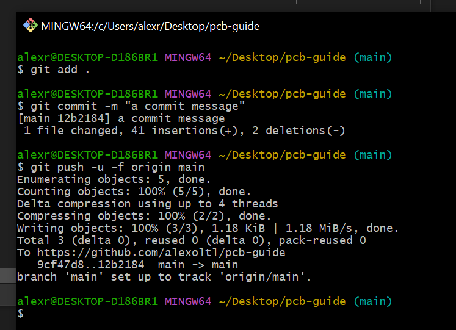

# alexoltl's keyboard pcb guide

## todo
 - add images
 - add syntax
 - add usbc
 - add tracing

This guide focuses on the creation of a keyboard's schematic and the pcb.

To get started, install the latest version of KiCad from this website [here]().

KiCad is a PCB and electronic schematic creator. We'll use it to make the keyboard.

A great way of saving your data, make backups, and easily revert versions is to make a Github repository where the KiCad files will be saved on. You've most likely made an account and use Github already, but if not, make an account and install Git. 

For the sake of simplicity, I'm going to make a numpad in this tutorial.

Once you've made a repository, press the `Code` button on the top right and download the zip.

Extract the zip to a suitable location, and unzip it. 

Now create a new KiCad project and save it inside the folder you just unzipped (If you want to use the repository for multiple KiCad projects, you save it into a new directory inside the folder). This will create 3 main files, one with a .kicad_pro extention, a .kicad_pcb extention, and a .kicad_sch extention.

KiCad comes with it's own library of symbols and footprints to use, but by default, there aren't any for keyboards. To add them, open the project folder, right click, and open Git Bash.

Run the command `git submodule add https://github.com/ebastler/marbastlib/`. Marbastlib is a library for keyboards which we will use. While Git Bash is still open, we may as well make a commit.

To commit, you need to run these 3 commands
```
git add .
```
This command tells Git to check all the files in the directory and look for the changes made
```
git commit -m "a commit message"
```
This command tells git to commit and add a message. You can change the message to whatever you want it to be.
```
git push -u -f origin main
```
This command makes the changes visible on the website. The extra flags are there to prevent some errors, don't forget them.

