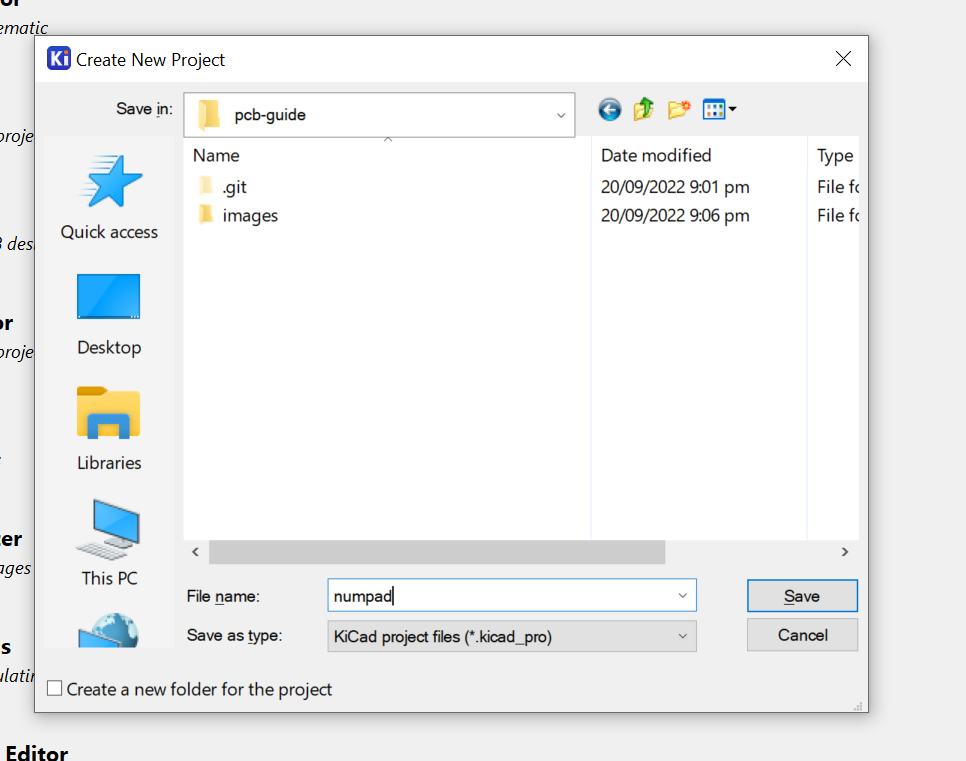

# alexoltl's keyboard pcb guide

This guide focuses on the creation of a keyboard's schematic and the pcb. It's still in progress.
I am focusing on Cherry MX type switches, however using other types should be pretty similar.

## Setting up

This tutorial uses KiCad. It's a PCB and electronic schematic creator. Install the latest version of KiCad from this website [here](https://www.kicad.org/download). I am using version 6.0.7.

A great way of saving your data, make backups, and easily swap between versions is to make a Github repository where the KiCad files will be saved on. You've most likely made an account and use Github already, but if not, make an account and [install Git](https://git-scm.com/downloads). Github also makes it easy to install libraries that we use for KiCad.

Make a repository, and press the `Code` button on the top right and download the zip (or you can clone it). 


Move the zip to a suitable location, and unzip it. This will be the place where all the KiCad files will be saved at.

By default, KiCad comes with it's own collection of libraries to use, but there aren't any for keyboards. To add them, open the project folder, right click, and open Git Bash. 


Run the command `git submodule add https://github.com/ebastler/marbastlib/` and `git submodule add https://github.com/ai03-2725/random-keyboard-parts.pretty`. Marbastlib is a library for keyboard parts which we will use, and ai03's random keyboard parts include the connectors needed for the micro usb connector. You'll see that new folders have been created. This folder contains all the files needed for the libraies.


Open up KiCad, and go to Preferences -> Manage Footprint Libraries. 


Click the folder icon, navigate to the marbastlib folder, and select the `marbastlib-mx.pretty` folder.


Once you're done, close the window and go to Preferences -> Manage Symbol Libraries. This time select the `marbastlib-mx.kicad_sym` file to import.


Do the same for ai03's parts, selecting the .pretty folder for the footprints and the .lib file for the symbols.


### How to make a commit
To save a copy on Github, you commit. To commit, you need to run these 3 commands

```
git add .
git commit -m "a commit message"
git push -u -f origin main
```

`git add` tells Git to check all the files in the directory, look for the changes made, and add it to a list.

`git commit` tells git to commit to the website and the -m flag adds a message. You can change the message to whatever you want it to be.

`git push` command makes the changes visible on the website. The extra flags are there to prevent some errors, don't forget them.


We're now ready to start making the keyboard.

# The schematic

For the sake of simplicity, I'm going to make a numpad in this tutorial. If you're planning to make bigger keyboards, I'll leave some information in the [Miscellaneous section](#Miscellaneous) to get you started with that.

Create a new KiCad project (File -> New Project) and save it inside the folder where the repository is. You can decide if you want it to be into it's own directory. 



This will create 3 main files, one with a `.kicad_pro` extention, a `.kicad_pcb` extention, and a `.kicad_sch` extention. 

### Commands

Here is a good commands reference for the schematic editor, from Ruiqi Mao's PCB guide.

```
m: pick the component up and move it
g: drag the component up and move it while keeping wires attached to it
c: copy the component
e: edit the component
r: rotate the component
y: mirror the component
del: delete the component
esc: abort!
```

Here's extra commands that we'll use.

```
a: add symbol
w: create a wire
p: open power menu
ctrl + l: create a global label
```

## Placing first components

Open the `.kicad_pro` file and from there open the schematic editor.


You can select the `.kicad_sch` from the file list or press the schematic editor symbol.


Start by placing the symbol for an `ATmega32u2`. This component is a microcontroller, the chip of the keyboard, and will handle all keypresses. Usually for bigger PCBs I would use an `ATmega32u4` instead, but the 32u2 is perfect because we don't need many ports and it's cheaper.


Now that the microcontroller has been placed, connect the VCC pins at the top to a VCC power symbol. Open the power menu and then search for VCC. Place it near the 3 VCC pins at the top.


Connect the VCC symbol to the pins by starting a wire at the symbol and connect it to the pins, by clicking once.


Do the same to the GND pins at the bottom of the PCB.


A crystal is a component in electricals that tells how fast a component is supposed to run at. Find the `Crystal_GND24_Small` in the symbols menu, and place it somewhere on the board.

Wire it through 2 capacitors (`C_Small` symbol) like this. 


(Remember to rotate the crystal)

Edit both `C_Small` symbols (hover over component or select and press E) and change the value to 14pF.


You'll see that the text on both capcitors changed from C_Small to 14pF.


A global label is a function to connect two wires together anywhere on the board, and make it easier to look at. Add a global label with `Ctrl + L` at the XTAL1 pin, called XTAL1, and press `R` to rotate it while it's selected to change the orientation.


Connect another XTAL1 symbol at the crystal.


This way, you can move the crystal to wherever you want on the board, and KiCad will still know where it's supposed to be connected.

Connect one XTAL2 label to the XTAL2 pin and one at the other side of the crystal. You should have this afterwards.


The crystal is complete.

Decoupling capacitors are needed for each of the VCC pins, so we need 3 additional capacitors. There's a good video explaining them [here](https://www.youtube.com/watch?v=mk61DNz27FI). We're only going to need 1 bulk and 2 local capacitors for the `ATmega32u2`.


It's a good idea to have a reset button, in the case of failures. This needs a pullup resistor (symbol `R_Small`) to prevent misstriggers and a ground on the other side.


To connect the PCB to a device, it needs to have a port to be able to connect to it. There are 2 options that I know, which is micro usb and USB-C. USB-C is more complicated and harder to do (you need to work with 15 pins whereas micro usb only uses 2 pins), so it'll be linked [here](#usb-c).

We're going to use micro usb for this, so add a `Molex-0548190589` component to the schematic.


This component is going to use a polyfuse. You can see it working [here](https://www.youtube.com/watch?v=ZW-hRNV62X8). Basically, a polyfuse automatically resets itself after it's safe to. This is incredibly helpful, as we don't need to open the keyboard and replace the fuse every time it blows. 

Connect it like below


The D+ and D- labels connects to its D+ and D- pins on the microcontroller.


Add a 1uF capacitor to the UCAP pin.


Add a 10k resistor to the PD7 pin.


All that's needed for the schematic now is to add the switches.

From marbastlib, get the 1U switch. There are 2 variants. One is the hotswap varient, which has support for the Kaihl Hotswap Sockets, and the solder varient, which doesn't have hotswap sockets. I'll use the hotswap varient but you can use whichever one.


We're going to set it up so that each switch has a unique row and column identifier. This will be helpful when you're coding the firmware for the keyboard later on as well.


Add a switch and place a diode underneath it. (Orientaion for the diode matters)


Copy paste this for however many keys you need, in a grid. For the numpad, this is what it looks like


Connect the rows and collumns.


Attach global labels to each row and collumn.


It starts from 0 because that's how QMK and VIA (firmware software) processes the rows.


The schematic is finished. Now to port all of the schematic to the PCB, All the components 